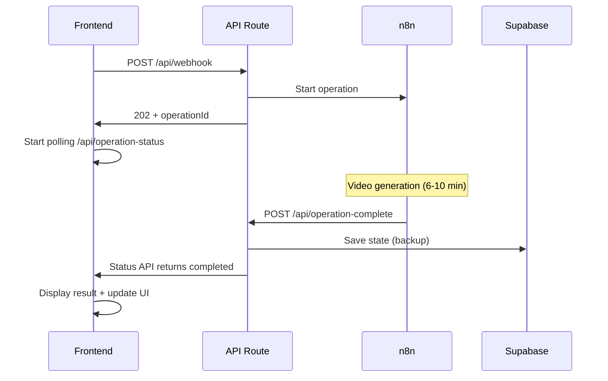
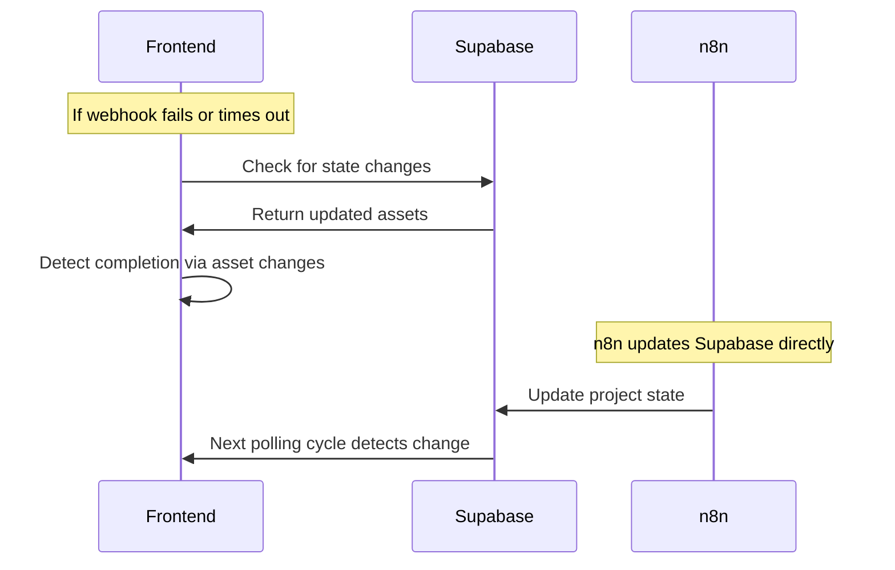

# 🏗️ Professional Webhook Architecture

## 📋 **Problem Statement**

The previous implementation had a fundamental flaw:
1. **n8n completes video generation** (6-10 minutes) ✅
2. **n8n tries to send webhook response** → **Gateway timeout** (response lost) ❌
3. **Frontend monitors Supabase** → **No guarantee n8n updates it** ❌
4. **Result: No completion notification** → **UI spins forever** ❌

## 🎯 **Professional Solution: Dual-Channel Architecture**

### **Channel 1: Webhook Callback (Primary)**
- **Purpose**: Immediate completion notification
- **Reliability**: Direct n8n → Frontend communication
- **Used by**: AWS Lambda, Stripe, Google Cloud

### **Channel 2: Database Monitoring (Backup)**
- **Purpose**: Fallback for missed webhooks
- **Reliability**: Continuous state monitoring
- **Used by**: Long-running batch systems

---

## 🔧 **Implementation Details**

### **1. Completion Webhook Endpoint**
```typescript
// URL: /api/operation-complete
// Method: POST
// Called by: n8n when operation completes
```

**Request Format:**
```json
{
  "operationId": "op_1234567890_abc123",
  "projectId": "39cfcde5-b810-472a-a35e-50ead39d87c8",
  "result": {
    "response_to_user": "🎬 Your video has been generated successfully! Here's your video link: https://...",
    "updatedStateJson": {
      "project_id": "39cfcde5-b810-472a-a35e-50ead39d87c8",
      "assets": {
        "video_clips": ["https://video1.mp4", "https://video2.mp4"],
        "final_video": "https://final-video.mp4",
        "core_idea": "Product demonstration video",
        "target_audience": "Tech enthusiasts"
      },
      "phase": "video_generation_complete",
      "checklist": {
        "video_clips_generated": true,
        "assembly_complete": true
      },
      "budget": {
        "spent": 8,
        "total": 15
      }
    }
  }
}
```

### **2. Operation Status API**
```typescript
// URL: /api/operation-status/{operationId}
// Method: GET
// Used for: Reliable polling without webhook complexity
```

**Response Format:**
```json
{
  "operationId": "op_1234567890_abc123",
  "status": "pending" | "completed" | "error",
  "startTime": 1672531200000,
  "duration": {
    "milliseconds": 420000,
    "seconds": 420,
    "minutes": 7
  },
  "result": { /* WebhookResponse */ },
  "error": null,
  "timestamp": "2024-01-01T12:00:00Z"
}
```

### **3. Intelligent Polling Strategy**
```typescript
// Phase 1 (0-30s): Fast polling every 500ms - text responses
// Phase 2 (30s-2m): Medium polling every 2s - image generation  
// Phase 3 (2m+): Database monitoring every 15s - video generation
```

---

## 🎯 **n8n Configuration Guide**

### **Required n8n Workflow Changes**

#### **Step 1: Add Completion Webhook Node**
Add this at the END of your n8n workflow:

```json
{
  "node": "HTTP Request",
  "name": "Notify Completion",
  "method": "POST",
  "url": "https://your-app.com/api/operation-complete",
  "headers": {
    "Content-Type": "application/json"
  },
  "body": {
    "operationId": "{{ $('Start').item.json.operationId }}",
    "projectId": "{{ $('Start').item.json.project_id }}",
    "result": {
      "response_to_user": "🎬 Your video has been generated successfully! Here's your video link: {{ $('Video Generation').item.json.video_url }}",
      "updatedStateJson": {
        "project_id": "{{ $('Start').item.json.project_id }}",
        "assets": {
          "video_clips": "{{ $('Video Generation').item.json.video_clips }}",
          "final_video": "{{ $('Video Generation').item.json.final_video }}",
          "core_idea": "{{ $('Start').item.json.core_idea }}",
          "target_audience": "{{ $('Start').item.json.target_audience }}"
        },
        "phase": "video_generation_complete",
        "checklist": {
          "video_clips_generated": true,
          "assembly_complete": true
        },
        "budget": {
          "spent": "{{ $('Budget Tracker').item.json.spent }}",
          "total": 15
        }
      }
    }
  }
}
```

#### **Step 2: Pass Operation ID Through Workflow**
Ensure the `operationId` from the initial request is passed through all nodes:

```json
{
  "node": "Set",
  "name": "Preserve Operation ID",
  "values": {
    "operationId": "{{ $('Webhook').item.json.operationId }}"
  }
}
```

#### **Step 3: Error Handling**
Add error handling to notify failures:

```json
{
  "node": "HTTP Request",
  "name": "Notify Error",
  "method": "POST",
  "url": "https://your-app.com/api/operation-complete",
  "body": {
    "operationId": "{{ $('Start').item.json.operationId }}",
    "projectId": "{{ $('Start').item.json.project_id }}",
    "error": "{{ $('Error Handler').item.json.error_message }}",
    "status": "error"
  }
}
```

---

## 🔄 **Operation Flow**

### **Frontend → n8n → Frontend**


### **Backup Database Monitoring**


---

## 🚀 **Benefits of This Architecture**

### **✅ Reliability**
- **Primary**: Direct webhook callback (immediate notification)
- **Backup**: Database monitoring (catches missed webhooks)
- **Fallback**: Intelligent timeout handling

### **✅ Professional Standards**
- **Used by AWS Lambda**: Completion callbacks + CloudWatch monitoring
- **Used by Stripe**: Webhooks + polling API
- **Used by Google Cloud**: Pub/Sub + direct status checks

### **✅ User Experience**
- **Quick operations**: Immediate response (< 1 second)
- **Medium operations**: Fast feedback (< 2 minutes)
- **Long operations**: Real progress tracking (up to 20 minutes)

### **✅ Debugging**
- **Clear operation tracking**: Each operation has unique ID
- **Detailed logging**: Every step logged with timestamps
- **Status API**: Direct operation status queries

---

## 🔧 **Testing the Implementation**

### **1. Test Completion Webhook**
```bash
curl -X POST https://your-app.com/api/operation-complete \
  -H "Content-Type: application/json" \
  -d '{
    "operationId": "test_op_123",
    "projectId": "test_project",
    "result": {
      "response_to_user": "Test completion",
      "updatedStateJson": {
        "project_id": "test_project",
        "assets": { "test": true },
        "phase": "completed",
        "checklist": {},
        "budget": { "spent": 0, "total": 15 }
      }
    }
  }'
```

### **2. Test Status API**
```bash
curl https://your-app.com/api/operation-status/test_op_123
```

### **3. Test Full Flow**
1. Send message to trigger video generation
2. Watch console for operation ID
3. Check status API directly
4. Verify completion webhook called
5. Confirm UI updates correctly

---

## 📊 **Monitoring & Debugging**

### **Console Logs to Watch**
```bash
# Operation start
🚀 Starting intelligent monitoring for operation op_1234567890_abc123

# Polling progress
⏳ [30s] Operation still running (15 polls)

# Completion detection
✅ [7m] Operation completed via status API (210 polls)

# Webhook callback
🎯 Operation completion webhook called
✅ Operation op_1234567890_abc123 completed successfully via webhook callback
```

### **Common Issues & Solutions**

| Issue | Cause | Solution |
|-------|-------|----------|
| Operation not found | n8n didn't call completion webhook | Check n8n workflow has completion node |
| Gateway timeouts | Normal for long operations | System handles automatically |
| Supabase monitoring fails | Database monitoring as backup | Primary webhook should still work |
| UI spins forever | Both channels failed | Check n8n logs and webhook configuration |

---

## 🎯 **Next Steps**

1. **Configure n8n** with completion webhook nodes
2. **Test with short operations** (text responses)
3. **Test with long operations** (video generation)
4. **Monitor logs** for successful completion flow
5. **Add real-time notifications** (WebSocket enhancement)

This architecture provides **enterprise-grade reliability** for long-running operations while maintaining **simple implementation** and **excellent user experience**. 